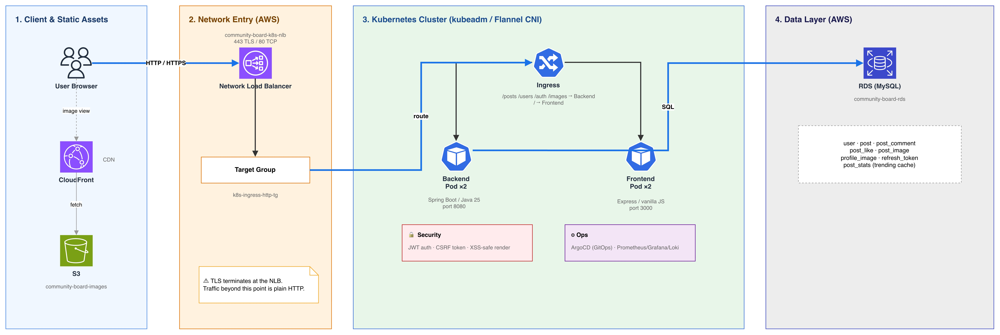
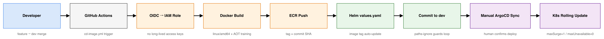

# Dessert Log 🍰

맛집 및 카페 리뷰를 공유할 수 있는 커뮤니티 서비스의 백엔드 서버입니다.

## 프로젝트 정보

| 항목 | 내용 |
| --- | --- |
| 프로젝트명 | Dessert Log 🍰 |
| 서비스 유형 | 지역 기반 맛집/카페 리뷰 커뮤니티 |
| 배포 URL | https://community-board.p-e.kr |
| Front-end | [4-cindy-community-FE](https://github.com/100-hours-a-week/4-cindy-community-FE) |

## 아키텍처



### 배포 파이프라인



## 기술 스택

| 구분 | 기술 |
| --- | --- |
| Backend | Java 25, Spring Boot 4.0.6, Spring WebMVC |
| Persistence | Spring Data JPA, QueryDSL 5.1.0, MySQL |
| Security | Spring Security, JWT, CSRF |
| Image | AWS S3, CloudFront, Thumbnailator, Scrimage |
| Infra | Docker, Kubernetes(kubeadm / Flannel CNI), Helm |
| Monitoring | Spring Boot Actuator, p6spy |
| CI/CD | GitHub Actions, AWS OIDC, ECR, ArgoCD |

## 주요 기능

| 기능 | 설명 |
| --- | --- |
| 회원 및 인증 | 회원가입, 로그인, 로그아웃, JWT 재발급, 회원 정보 수정, 비밀번호 변경 |
| 게시글 | 게시글 생성, 목록 조회, 상세 조회, 수정, 삭제, 조회수 증가 |
| 댓글 | 게시글별 댓글 생성, 조회, 수정, 삭제 |
| 좋아요 | 게시글 좋아요 등록, 상태 조회, 취소 |
| 인기글 랭킹 | Hacker News 계열 시간 감쇠 알고리즘 기반 랭킹, 5분 주기 배치 계산 |
| 이미지 | 프로필/게시글 이미지 업로드, S3 저장, CloudFront URL 제공 |

## 서버 구조

| 영역 | 패키지 | 역할 |
| --- | --- | --- |
| API | `controller` | HTTP 요청 및 응답 처리 |
| Service | `service` | 비즈니스 로직 처리 |
| Domain | `domain` | JPA Entity |
| Repository | `repository` | JPA, QueryDSL, JdbcTemplate 기반 데이터 접근 |
| Security | `config`, `filter`, `jwt` | 인증, 인가, CORS, CSRF, JWT 처리 |
| Scheduler | `scheduler` | 트렌딩 점수 계산, 이미지 및 삭제 데이터 정리 |
| Common | `global` | 공통 응답 및 예외 처리 |

## 폴더 구조

```text
.
├── Dockerfile
├── build.gradle
├── docker-compose.yml
├── be-chart/
│   ├── Chart.yaml
│   ├── values.yaml
│   └── templates/
│       ├── configmap.yaml
│       ├── deployment.yaml
│       └── service.yaml
├── docs/images/
│   ├── architecture.jpeg
│   └── cd-pipeline.jpeg
└── src/main/java/community_board/
    ├── config/
    ├── controller/
    ├── domain/
    ├── dto/
    ├── filter/
    ├── global/
    ├── jwt/
    ├── repository/
    ├── scheduler/
    └── service/
```

## 보안

| 항목 | 내용 |
| --- | --- |
| 인증 | JWT 기반 인증 |
| 토큰 저장 | `accessToken`, `refreshToken` HttpOnly Cookie |
| CSRF | Spring Security `csrf.spa()` |
| CORS | `http://localhost:3000`, `https://community-board.p-e.kr` |
| Session | `STATELESS` |
| Cookie | `SameSite=Lax`, `APP_ENV=production`일 때 `Secure=true` |
| 입력 검증 | Bean Validation 기반 DTO 검증 |

## 성능 및 인프라

- AOT Cache 적용으로 애플리케이션 시작 시간 개선: `67초 -> 25초`, 약 `62%` 감소
- 트렌딩 목록은 `post_stats` 조인으로 댓글 수와 좋아요 수 조회 최적화
- 일반 게시글 목록은 게시글별 count 쿼리 구조로, `post_stats` 조인 또는 집계 쿼리 개선 여지 존재
- Kubernetes `replicaCount: 2`, Rolling Update `maxSurge: 1`, `maxUnavailable: 0`
- Actuator 기반 startup/liveness/readiness probe 적용

## 배포

```text
dev branch push 또는 workflow_dispatch
-> GitHub OIDC로 AWS 권한 획득
-> Docker Buildx 이미지 빌드
-> ECR push
-> be-chart/values.yaml image.tag 갱신
-> github-actions[bot] 커밋 및 push
-> ArgoCD 수동 Sync
-> Kubernetes Rolling Update
```

`be-chart/**` 경로 변경은 CD workflow trigger에서 제외하여 이미지 태그 갱신 커밋으로 인한 재빌드 루프를 방지합니다.

## API 명세

| Method | Endpoint | 설명 |
| --- | --- | --- |
| POST | `/users` | 회원가입 |
| GET | `/users/{userId}` | 회원 정보 조회 |
| PATCH | `/users/{userId}` | 회원 정보 수정 |
| PUT | `/users/{userId}/password` | 비밀번호 변경 |
| DELETE | `/users/{userId}` | 회원 탈퇴 |
| POST | `/auth` | 로그인 |
| DELETE | `/auth` | 로그아웃 |
| POST | `/token` | access token 재발급 |
| POST | `/posts` | 게시글 생성 |
| GET | `/posts` | 게시글 목록 조회 |
| GET | `/posts/trending` | 인기글 목록 조회 |
| GET | `/posts/{postId}` | 게시글 상세 조회 |
| POST | `/posts/{postId}/views` | 게시글 조회수 증가 |
| PATCH | `/posts/{postId}` | 게시글 수정 |
| DELETE | `/posts/{postId}` | 게시글 삭제 |
| POST | `/posts/{postId}/comments` | 댓글 생성 |
| GET | `/posts/{postId}/comments` | 댓글 목록 조회 |
| PUT | `/posts/{postId}/comments/{commentId}` | 댓글 수정 |
| DELETE | `/posts/{postId}/comments/{commentId}` | 댓글 삭제 |
| POST | `/posts/{postId}/likes` | 좋아요 등록 |
| GET | `/posts/{postId}/likes` | 좋아요 상태 조회 |
| DELETE | `/posts/{postId}/likes` | 좋아요 취소 |
| POST | `/images/post` | 게시글 이미지 업로드 |
| GET | `/posts/{postId}/images` | 게시글 이미지 목록 조회 |
| GET | `/posts/{postId}/images/{postImageId}/file?type={type}` | 게시글 이미지 파일 조회 |
| PUT | `/posts/{postId}/images` | 게시글 이미지 교체 또는 삭제 |
| POST | `/images/profile` | 프로필 이미지 업로드 |
| GET | `/users/{userId}/profile-image` | 프로필 이미지 조회 |
| GET | `/users/{userId}/profile-image/file?type={type}` | 프로필 이미지 파일 조회 |
| PUT | `/users/{userId}/profile-image` | 프로필 이미지 교체 또는 삭제 |
| GET | `/actuator/**` | Health check |

## 로컬 실행

### 사전 준비

- JDK 25
- MySQL
- AWS S3 접근 권한
- JWT secret

### 설정 예시

```yaml
spring:
  datasource:
    url: jdbc:mysql://localhost:3306/community_board
    username: <your-db-username>
    password: <your-db-password>
    driver-class-name: com.mysql.cj.jdbc.Driver
  jpa:
    hibernate:
      ddl-auto: update
jwt:
  issuer: community-board
  secret-key: <your-jwt-secret>
file:
  upload-dir: uploads
  max-size: "10485760"
cloud:
  aws:
    s3:
      bucket: <your-s3-bucket>
    region:
      static: ap-northeast-2
cloudfront:
  domain: <your-cloudfront-domain>
```

### 실행

```bash
./gradlew bootRun
```

### 테스트

```bash
./gradlew test
```

## 환경값 확인 방법

| 항목 | 확인 방법 |
| --- | --- |
| DB 이름 및 계정 | 로컬 MySQL 또는 로컬 `application.yml` 확인 |
| JWT secret | Kubernetes Secret 또는 로컬 환경변수 확인 |
| S3/CloudFront | `be-chart/values.yaml`의 `application.aws.s3Bucket`, `application.cloudfront.domain` 확인 |
